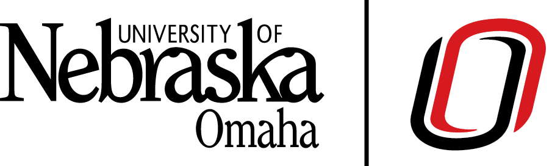
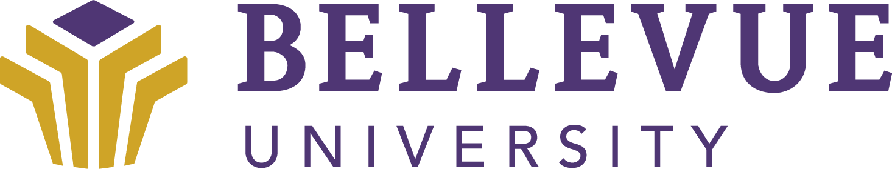
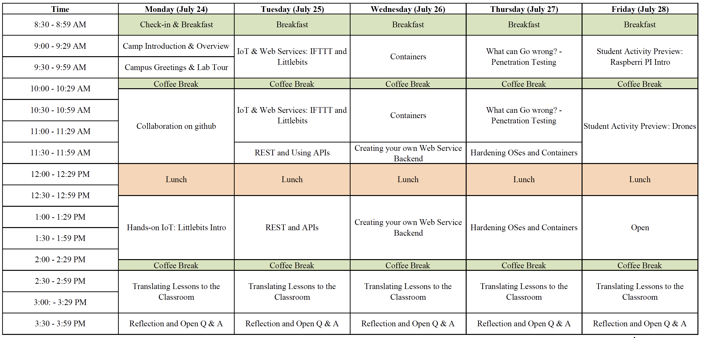
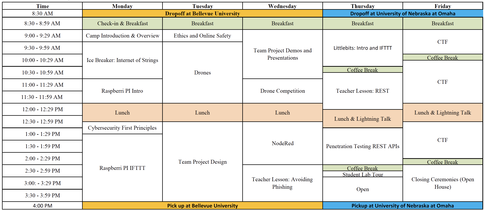
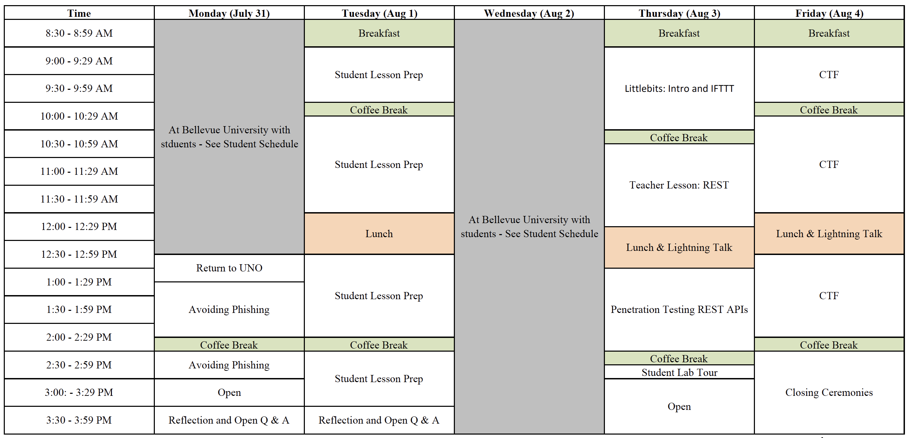
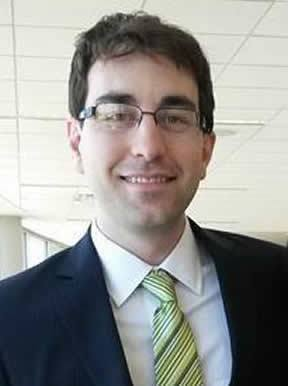

# Nebraska GenCyber @ [The University of Nebraska at Omaha](http://www.unomaha.edu/college-of-information-science-and-technology/academics/information-assurance.php) and [Bellevue University](http://www.bellevue.edu/degrees/center-for-cybersecurity-education/cce)
This repo includes all open source content for the Nebraska GenCyber camp. Files in this repository are intended to provide step-by-step self paced tutorials to teachers seeking to learn about cybersecurity first principles as part of the UNO Gencyber camp. The strategy is to *learn by doing*. The 2017 camp theme is `IoT Security`.

## Slack channel and social media
Want to get a hold of camp staff or fellow campers? Use [our official Slack Channel](https://join.slack.com/t/nebraskagencyber/shared_invite/MjE3NzAyMDczOTkxLTE1MDA4NzMxODYtNjI0ODBiYTU2MA). You can sign up for free.

### Twitter
Social media is welcome at camp - use the hashtag `#nebraskagencyber`

## Camp Schedule
### Week One
  

### Week Two
#### Students
  

#### Teachers

# Camp Content
The guides are organized by camp days and are available at the linked urls:

## Week One Events
Teachers, for a full list of lessons in Week one, check out the [Teacher's Zone](./teachers/README.md)

## Week Two Events
### Day 1: TBA
### Day 2: TBA
### Day 3: TBA
1. Project Presentations
1. Phishing Lesson

### Day 4: Title here
1. Littlebits Intro and IFTTT
1. REST APIs
1. Penetration Testing

### Day 5: Capture the Flag Contest
* [Jeopardy style contest among student-teacher teams](http://ctf.gencyber2017.unomaha.edu)
* [Facebook ctf setup](./facebookctf/fbctf.md)

## Evaluation Forms
* [Student Module Evaluation Form](https://unomaha.az1.qualtrics.com/jfe/form/SV_d6fG6S6YsTIdMTb)
* [Teacher Module Evaluation Form](https://unomaha.az1.qualtrics.com/jfe/form/SV_8q4cebgz9jXh301)
* [Exit Survey (Teachers)](https://www.surveymonkey.com/r/NebraskaOmaha_C1_T1_July24_Aug4)
* [Exit Survey (Students)](https://www.surveymonkey.com/r/NebraskaOmaha_C1_S1_July24_Aug4)

## Contacts

#### Nebraska GenCyber Program Director (Primary Point of Contact)
  
[Dr. Matt Hale](http://faculty.ist.unomaha.edu/mlhale/)    
Assistant Professor of Cybersecurity  
University of Nebraska at Omaha    
[mlhale@unomaha.edu](mailto:mlhale@unomaha.edu)

#### Bellevue Point of Contact
  
[Douglas Rausch](http://www.bellevue.edu/about/leadership/faculty/rausch-douglas)   
Assistant Professor & Program Director BSCYBR and MSCYBR  
Bellevue University  
[drausch@bellevue.edu](mailto:drausch@bellevue.edu)

#### Co-Investigator / Instructors
  
[Dr. Robin Gandhi](http://faculty.ist.unomaha.edu/rgandhi/)    
Associate Professor of Cybersecurity  
University of Nebraska at Omaha  

  
[Dr. Briana B. Morrison](http://www.brianamorrison.net)  
Assistant Professor of Computer Science (Education)  
University of Nebraska at Omaha  

#### Instructors
Gary Sparks
Rosas Guillermo
Courtney Saffold

#### Administrative Support
  
[Amy Kelley](https://www.unomaha.edu/college-of-information-science-and-technology/about/faculty-staff/amy-kelley.php)  
Executive Associate
University of Nebraska at Omaha  
[amykelley@unomaha.edu](mailto:amykelley@unomaha.edu)

## How to Contribute?

First fork this repo on Github.com while logged into your account. Then clone the forked repo on your computer.

Now you will need two capabilities: 1) Keep your fork (downstream) synced with this repo (upstream) and 2) Make upstream pull requests for changes made in the forked repo. Both these can be accomplished by following these steps:  

1. [Fork a Repo](https://help.github.com/articles/fork-a-repo/)  
1. [Syncing a Fork](https://help.github.com/articles/syncing-a-fork/)  
1. Push changes to your remote fork: `git push origin master`  
1. [Create a pull request from a fork](https://help.github.com/articles/creating-a-pull-request-from-a-fork/)  

More advanced collaboration features can be found here: https://help.github.com/categories/collaborating-on-projects-using-issues-and-pull-requests/

In general, if you are making it a pull request you agree to abide by this CLA: https://cla.github.com

# License  
[Nebraska GenCyber](https://github.com/MLHale/nebraska-gencyber)   is licensed under a <a rel="license" href="http://creativecommons.org/licenses/by-nc-sa/4.0/">Creative Commons Attribution-NonCommercial-ShareAlike 4.0 International License</a>.

Overall content: Copyright (C) 2017  [Dr. Matthew L. Hale](http://faculty.ist.unomaha.edu/mhale/), [Dr. Robin Gandhi](http://faculty.ist.unomaha.edu/rgandhi/), and [Doug Rausch](http://www.bellevue.edu/about/leadership/faculty/rausch-douglas).  
Individual content: Copyright (C) 2017 as listed in each lesson.

Any programs or code snipets included in this work are free software: you can redistribute them and/or modify them under the terms of the GNU General Public License as published by
the Free Software Foundation, either version 3 of the License, or (at your option) any later version.

This program is distributed in the hope that it will be useful,
but WITHOUT ANY WARRANTY; without even the implied warranty of
MERCHANTABILITY or FITNESS FOR A PARTICULAR PURPOSE.  See the
GNU General Public License for more details.

You should have received a copy of the GNU General Public License
along with this program.  If not, see <http://www.gnu.org/licenses/>.
