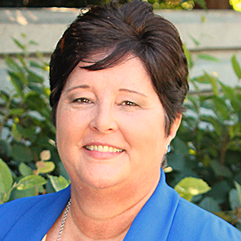

# Nebraska GenCyber @ [The University of Nebraska at Omaha](http://www.unomaha.edu/college-of-information-science-and-technology/academics/information-assurance.php) and [Bellevue University](http://www.bellevue.edu/degrees/center-for-cybersecurity-education/cce)
This repo includes all open source content for the Nebraska GenCyber camp. Files in this repository are intended to provide step-by-step self paced tutorials to teachers seeking to learn about cybersecurity first principles as part of the UNO Gencyber camp. The strategy is to *learn by doing*. The 2017 camp theme is `IoT Security`.

# Camp Study Guides
The guides are organized by camp days and are available at the linked urls:

## Camp Schedule
### Week One
[Teachers Week 1](./schedule/uno-camp-schedule-teachers-week1.png)

### Week Two
[Students Week 2](./schedule/uno-camp-schedule-students-week2.png)
[Teachers Week 2](./schedule/uno-camp-schedule-teachers-week2.png)

## Week One Events
Teachers, for a full list of lessons in Week one, check out the [Teacher's Zone](./teachers/README.md)

## Week Two Events
### Day 1: Title here
### Day 2: Title here
### Day 3: Title here
1. <link 1 here>
1. <link 2 here>

### Day 4: Title here
1. <link 1 here>
1. <link 2 here>

### Day 5: Capture the Flag Contest
* [Jeopardy style contest among student-teacher teams](http://ctf.gencyber2017.unomaha.edu)
* [Facebook ctf setup](./facebookctf/fbctf.md)

## Evaluation Forms
* [Student Evaluation Form](https://docs.google.com/forms/d/e/1FAIpQLSfaTgdb9j8x86PVtDRYB0XSJZHDF0M2g8-R5QD-_aJmKs-lLw/viewform)
* [Teacher Peer Evaluation Form](https://docs.google.com/forms/d/e/1FAIpQLSeApna8ZsyeOtrWHEmlr_epKYarDq4EaxYnIPoyV3HDDVOTeA/viewform)
* [Teacher Module Evaluation Form](https://docs.google.com/forms/d/e/1FAIpQLSfGxM5p10WfOeANDcxylNF240cVEeFew8HbCsAjss5IJawVyQ/viewform)
* [Exit Survey (Teachers)](https://www.surveymonkey.com/r/AIMInstitute_T1)
* [Exit Survey(Students)](https://www.surveymonkey.com/r/AIMInstitute_S1)

## Contacts

#### Nebraska GenCyber Program Director and Primary Point of Contact

[Dr. Matt Hale](http://faculty.ist.unomaha.edu/mlhale/)   
Assistant Professor of Cybersecurity  
University of Nebraska at Omaha    
[mlhale@unomaha.edu](mailto:mlhale@unomaha.edu)

#### Bellevue Point of Contact

[Dr. Douglas Rausch](http://www.bellevue.edu/about/leadership/faculty/rausch-douglas)   
Assistant Professor & Program Director BSCYBR and MSCYBR  
Bellevue University  
[drausch@bellevue.edu](mailto:drausch@bellevue.edu)

#### Co-Investigator / Instructors

[Dr. Robin Gandhi](http://faculty.ist.unomaha.edu/rgandhi/)    
Associate Professor of Cybersecurity  
University of Nebraska at Omaha  

[Dr. Briana B. Morrison](http://www.brianamorrison.net)  
Assistant Professor of Computer Science (Education)  
University of Nebraska at Omaha  

#### Instructors
insert Bellevue staff here

#### Administrative Support

[Amy Kelley](https://www.unomaha.edu/college-of-information-science-and-technology/about/faculty-staff/amy-kelley.php)

Executive Associate
University of Nebraska at Omaha  
[amykelley@unomaha.edu](mailto:amykelley@unomaha.edu)

# License  
[Nebraska GenCyber](https://github.com/MLHale/nebraska-gencyber)   is licensed under a <a rel="license" href="http://creativecommons.org/licenses/by-nc-sa/4.0/">Creative Commons Attribution-NonCommercial-ShareAlike 4.0 International License</a>.

Overall content: Copyright (C) 2017  [Dr. Matthew L. Hale](http://faculty.ist.unomaha.edu/mhale/), [Dr. Robin Gandhi](http://faculty.ist.unomaha.edu/rgandhi/), and [Doug Rausch](http://www.bellevue.edu/about/leadership/faculty/rausch-douglas).  
Individual content: Copyright (C) 2017 as listed in each lesson.

Any programs or code snipets included in this work are free software: you can redistribute them and/or modify them under the terms of the GNU General Public License as published by
the Free Software Foundation, either version 3 of the License, or (at your option) any later version.

This program is distributed in the hope that it will be useful,
but WITHOUT ANY WARRANTY; without even the implied warranty of
MERCHANTABILITY or FITNESS FOR A PARTICULAR PURPOSE.  See the
GNU General Public License for more details.

You should have received a copy of the GNU General Public License
along with this program.  If not, see <http://www.gnu.org/licenses/>.
