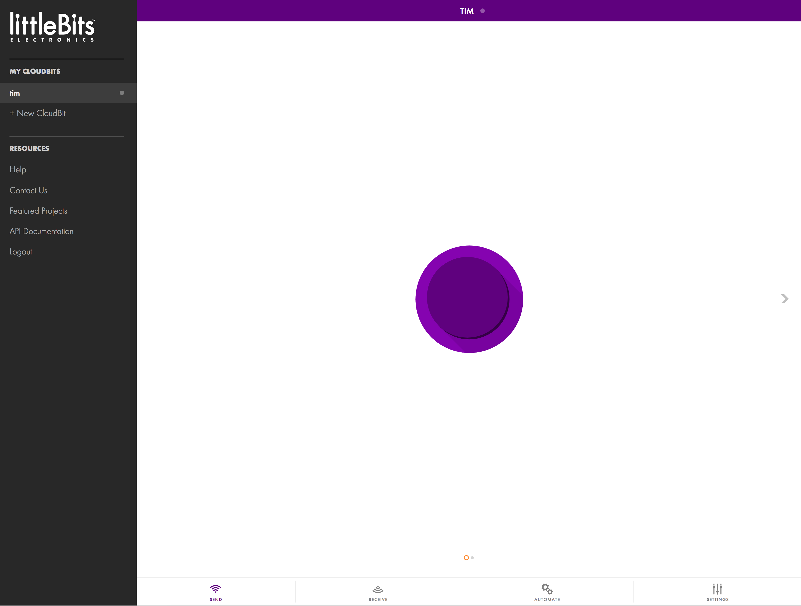

# Hands-on IoT: Littlebits IFTTT
### Cybersecurity First Principles in this lesson

* __Abstraction__: An abstraction is a representation of an object or concept. It could be something
such as a door, a speedometer, or a data structure in computer science. Abstraction decouples the design from the implementation. The gauges in an automobile are an abstraction of the performance of a car. A map is an abstraction of the earth.

* __Modularization__: The concept of modularity is like building blocks. Each block (or module) can be put in or taken out from a bigger project. Each module has its own separate function that is interchangeable with other modules.

* __Resource Encapsulation__: Encapsulation is an object oriented concept where all data and functions required
to use the resource are packaged into a single self-contained component. The goal is to only allow access or manipulation of the resource in the way the designer intended. An example, assume a flag pole is the object. There are fixed methods on how the flag pole is to be used. Put the flag on, take the flag off, raise or lower the flag. Nothing else can be done to the flag pole.

* __Data Hiding__: Data hiding is the technique that does not allow certain aspects of an object to be
observed or accessed. Data and information hiding keeps the programmer from having complete access to data structures. It allows access to only what is necessary.

* __Minimization__: Minimization refers to having the least functionality necessary in a program or device. The goal of minimization is to simplify and decrease the number of ways that software can be exploited. This can include **turning off ports that are not needed**, reducing the amount of code running on a machine, and/or turning off unneeded features in an application. This lesson focuses specifically on turning off ports that aren't in use.

### Introduction
In this lesson we will explore a cool hands-on technology called [Littlebits](http://littlebits.cc/). Littlebits, follows a _component-based design_ paradigm using _GPIO_ (or general purpose input/output) to let you easily make apps. We will learn how to plug and play bits together to make some simple inventions. Littlebits will be the central platform for the rest of camp and you will be using them in other lessons.

### Materials Required

* Littlebits kit
* Power outlet nearby
* Wi-Fi Internet Connection

### Prerequisite lessons
[Littlebits Intro](../hands-on-iot-little-bits-intro/README.md)

### Table of Contents
<!-- TOC START min:1 max:3 link:true update:true -->
- [Hands-on IoT with - Littlebits Intro](#hands-on-iot-with---littlebits-intro)
    - [Cybersecurity First Principles in this lesson](#cybersecurity-first-principles-in-this-lesson)
    - [Introduction](#introduction)
    - [Materials Required](#materials-required)
    - [Prerequisite lessons](#prerequisite-lessons)
    - [Table of Contents](#table-of-contents)
    - [Step 1: Unbox it!](#step-1-unbox-it)
    - [Self Exploration](#self-exploration)
    - [Test you Bits, err... Wits!](#test-you-bits-err-wits)
    - [Additional Resources](#additional-resources)
    - [Acknowledgements](#acknowledgements)
    - [License](#license)

<!-- TOC END -->
### Before we START
In the last lesson, you saw how versatile, modular, and cool Littlebits was to work with. It was easy to plug and play different modules together following simple `design patterns` to make cool, simple, apps. Now, imagine everything you saw before can be hooked up to the internet and **controlled using a smartphone or online app**. We are going to do _THAT_ now!

### Step 1: Create an Account / Login to Littlebits portal!
To start we need to create an account:

* visit https://littlebits.cc/login and click `register`
* walk through the online instructions to create your account

### Step 2: Pair your Cloudbit with the portal
Now that we have an account, we need to pair our `Cloudbit` with the `Littlebits cloud platform`. To do that:

* Login at http://control.littlebitscloud.cc/ using your account info.
* Give your new `Cloudbit` a name: I decided to call mine "Tim" `Tim`.

* Follow the on-screen instructions to setup your `Cloudbit`.

* First connect the blue `power` module to the pink `button` module and then connect the `button` to the orange `cloudbit` module.
* Hold down the setup button on the cloudBit until the light blinks blue.
* When the light blinks, let go and wait for the light to turn a steady blue.
* Using Wi-Fi, connect to the local Wi-Fi network the device broadcasts (it will be something like litte_bits_cloud_somenumber).
* Once connected to the device's Wi-Fi adapter, pick the Wi-Fi network the cloudbit will live on. (At UNO that will be: `UNOGuest`).
* It should auto-connect and the light should turn a solid green color.
* You should see:

### Step 3: Push the giant (purple) button

The purple button on your screen is linked to your `Cloudbit` `output`.

* Add a green `LED` output module to the `Cloudbit`. Now Press it
* Now definitely press the giant purple `button` on your screen.

It works! With that you just made your first `IoT app`.

### Step 4: Using web services - connecting to IFTTT
`Web services` are, as the name implies, services that live on the web. You use these all the time - mostly without knowing it. The internet is built on top of them. Google, Dropbox, Youtube, Twitter, and Facebook are just a few juggernauts that provide and use web services. In this lesson, we are going to use a `mashup service` called [IFTTT](https://ifttt.com) (which stands for **I**f **T**his, **T**hen **T**hat ). **IFTTT** is a great platform that talks to all kinds of web services. One service it connects with is, conveniently, `Littlebits`.

* Connect your `cloud bit` to `IFTTT` by pressing the `automate` button in the `Littlebits` user interface.
* You will need to create an account if you don't already have one

### Step 5: Send email with your cloudbit

### Step 6: App pattern 2 (sensor)

### Step 7: App pattern 3 (actuator)

### Step 8: App pattern 4 (actuator)

### Self Exploration
Try some different designs yourself

### Test you Bits, err... Wits!
[Quiz](https://www.qzzr.com/c/quiz/430545/all-about-littlebits-introduction)

### Additional Resources
For more information, investigate the following.

* [Littlebits](http://littlebits.cc/how-it-works) - Overview of concepts and available bits
* [https://shop.littlebits.cc/products/smart-home-kit](https://shop.littlebits.cc/products/smart-home-kit) - Information about the smart home kit

### Acknowledgements
Special thanks to [Dr. Robin Gandhi](http://faculty.ist.unomaha.edu/rgandhi/) for reviewing and editing this lesson.

### License
[Nebraska GenCyber](https://github.com/MLHale/nebraska-gencyber)   is licensed under a <a rel="license" href="http://creativecommons.org/licenses/by-nc-sa/4.0/">Creative Commons Attribution-NonCommercial-ShareAlike 4.0 International License</a>.

Overall content: Copyright (C) 2017  [Dr. Matthew L. Hale](http://faculty.ist.unomaha.edu/mhale/), [Dr. Robin Gandhi](http://faculty.ist.unomaha.edu/rgandhi/), and [Doug Rausch](http://www.bellevue.edu/about/leadership/faculty/rausch-douglas).

Lesson content: Copyright (C) [Dr. Matthew L. Hale](http://faculty.ist.unomaha.edu/mhale/) 2017.  
 This lesson is licensed by the author under a <a rel="license" href="http://creativecommons.org/licenses/by-nc-sa/4.0/">Creative Commons Attribution-NonCommercial-ShareAlike 4.0 International License</a>.
